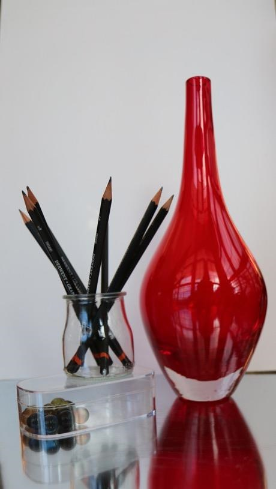

# Practical Exercise 1: Modelling "simple" shapes
By Luis Daniel Casais Mezquida & Lucía María Moya Sans  
Computer Graphics 22/23  
Bachelor's Degree in Computer Science and Engineering, grp. 89  
Universidad Carlos III de Madrid

# Project description
Model the objects shown in the following image by using POV-Ray:

  
  


It is not required to represent with high fidelity the textures and properties of the different objects.

# Installation and execution

First install [POV-Ray](https://github.com/POV-Ray/povray/tree/3.7-stable).

For Windows, use the [provided installer](https://www.povray.org/ftp/pub/povray/Official/povwin-3.7-agpl3-setup.exe), and for Linux, you can download it from your preferred package manager.  
For APT:
```bash
sudo apt update && sudo apt install povray
```

To render the file (`src/main.png`), run:
```bash
bash run.sh
```

# Extra information
In order to learn how to use POV-Ray, we recommend to use thei [POV-Ray Wiki](https://wiki.povray.org/content/Documentation:Contents), although it's mostly pure documentation.